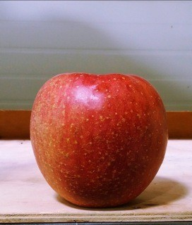
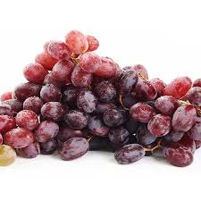
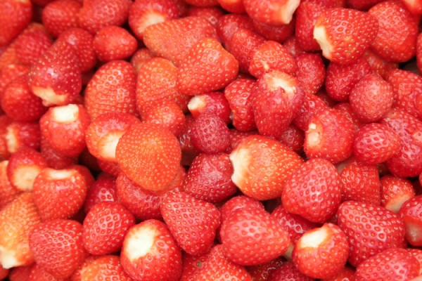
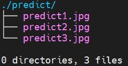
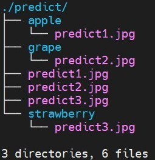

# CustomImageClassification

You can train some of your images to create a learning model.

And you can classify the remaining images using the created learning model.

This program supports AlexNet, VGGNet, and ResNet as training models.

---
When you have the data below,

<figure class="image">
  <figcaption>(predict1.jpg)</figcaption>
  
  <figcaption>(predict2.jpg)</figcaption>
  
  <figcaption>(predict3.jpg)</figcaption>
  
</figure>

The program categorizes the images as follows.

<figure class="image">
  <figcaption>(Before predict)</figcaption>
  
  <figcaption>(After predict)</figcaption>
  
</figure>

---

# How to use

1. Install Pytorch. (requirements.txt will be able to install pytorch only in the environment where cuda 11.0 version is installed.)

2. Customizing example.sh is much more helpful.

3. Run the following command in the Linux shell. (./example.sh)

4. (Option) Or you can run it in Python by combining the options below.

# Arguments

usage:
```
python3 main.py [--gpu_parallel GPU_PARALLEL] [--gpu_index GPU_INDEX] [--data_path DATA_PATH] [--batch_size BATCH_SIZE] [--shuffle SHUFFLE] [--model_name MODEL_NAME] [--model_pretrained MODEL_PRETRAINED] [--classes CLASSES] [--lr LR] [--epochs EPOCHS] [--printable PRINTABLE] [--load_model LOAD_MODEL] [--load_model_name LOAD_MODEL_NAME] [--save_model SAVE_MODEL] [--save_model_name SAVE_MODEL_NAME] [--predict PREDICT]

```

optional arguments:
```
--gpu_parallel False        When there are multiple GPUs, you can train GPUs in parallel by setting this option to True.

--gpu_index 0               You can choose which GPU to use. Index starts from 0.
                            (The gpu_parallel option should be False.)

--data_path "./data/"       You can set the location of your image data.
                            (The internal structure should be data/train, data/test, and data/predict.)
                            (It may be helpful to refer to the data folder in the example.)

--batch_size 8              When training the model, you can set the batch size.

--shuffle True              Determine whether to shuffle training data and test data.

--model_name resnet         Set up the model to be trained. resnet152 is set by default.

--model_pretrained True     This option allows you to import the parameters of the pre-trained model.

--classes 10                (Important) Set how many categories your data is in.

--lr 0.001                  Set the learning rate of the model.

--epochs 30                 Set how many times the model will be trained.
                            If it is 0, it is tested immediately without training.

--printable True            Print the progress on the screen. True is recommended.

--load_model False          This option is to set whether to use the saved model.

--load_model_name "./data/model.pt", 
                            Set the location of the saved model.
                            (The value of load_model must be True.)

--save_model False          Use it when you want to save your model.

--save_model_name "./data/model.pt"
                            Set the location to save the model.
                            (The value of save_model must be True.)

--predict False             You can classify images using models.

--predict_data_path --data_path + "predict/"
                            Set the location of the images you want to classify.
```